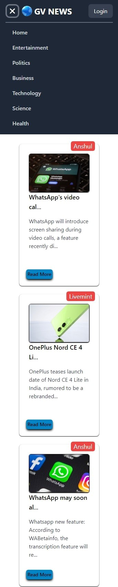

# GV-NEWS

A web-based news application developed using **React**, **Tailwind CSS** and **JavaScript/HTML/CSS**. It fetches data from a **_news API_** and displays news on various topics including general, entertainment, politics, business, technology, and science.

## Table of Contents

- [Features](#features)
- [Demo](#demo)
- [Requirements](#requirements)
- [Installation](#installation)
- [Usage](#usage)

## Features

- Fetches news data from a news API.
- Displays news on different topics.
- Responsive design using Tailwind CSS.
- Built with modern technologies: **React**, **JavaScript**, **HTML**, and **CSS**.

## Demo 

Check out the live demo: [GV-NEWS Live Demo](https://nishant100101.github.io/GV-NEWS/)




## Requirements

- **Node.js**: [https://nodejs.org/en](https://nodejs.org/en)
- **npm (or yarn)**: [https://www.npmjs.com/](https://www.npmjs.com/)
- **React**: [https://reactjs.org/](https://reactjs.org/)
- **Tailwind CSS**: [https://tailwindcss.com/](https://tailwindcss.com/)

## Installation

Follow these steps to set up the project locally:

1. **Clone the repository**:

   ```bash
   git clone https://github.com/Nishant0128/GV-NEWS.git
   ```

2. **Navigate to the project directory**:

   ```bash
   cd GV-NEWS
   ```

3. **Install the dependencies**:
   ```bash
   npm install
   ```
   or
   ```bash
   yarn
   ```
